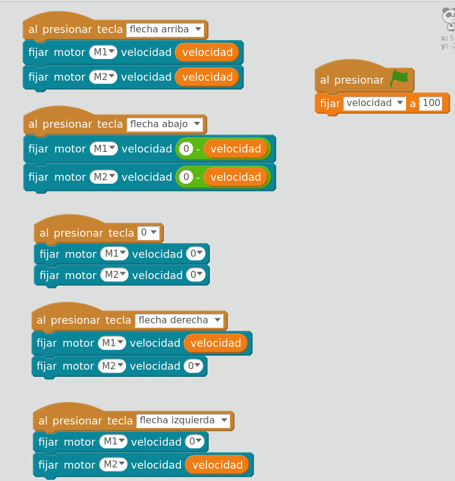

## Interacción Scratch/MakeBlock

### [Control de motores](../Fichas/ControlMotores.md)

[Interaccion Scratch/MakeBlock](../Ejemplos/ControlManual.sb2)

### [Sensor de distancia](./SensorDistancia.md)

[Control Motores Por Eventos](../Ejemplos/ControlMotoresPorEventos.sb2)

### [Sensor Infrarrojo](./SensorInfrarrojo.md)