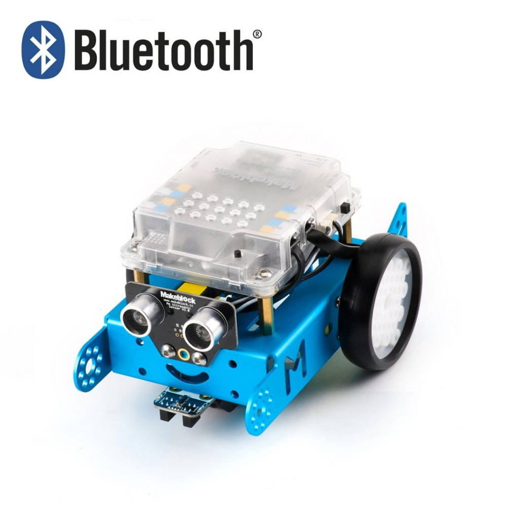
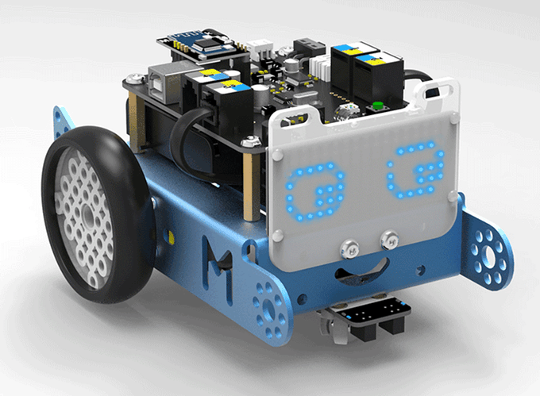

# Robótica con mBot

IES Pedro Jiménez Montoya

## http://bit.ly/RobmBot

Licencia CC by José Antonio Vacas @javacasm

# Introducción

El objetivo de esta documentación es aprender a usar un entorno de programación por medio de bloques que se denomina Scratch y que permite desarrollar aplicaciones a la vez que se interacciona con los equipos de iniciación a la robótica de MakeBlock.

## [Horario](./Horario.md)

## Documentación y ejemplos

### [mBot](https://www.makeblock.es/productos/robot_educativo_mbot/)

### [mBot pantalla led](https://makeblock.es/productos/mbot_matriz_leds/)

### [mBot Rosa](https://www.makeblock.es/productos/mbot_bluetooth_rosa/)