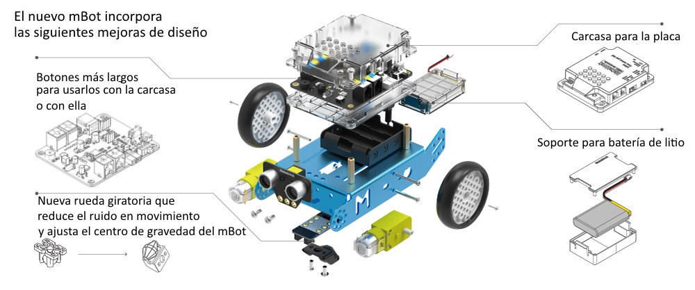
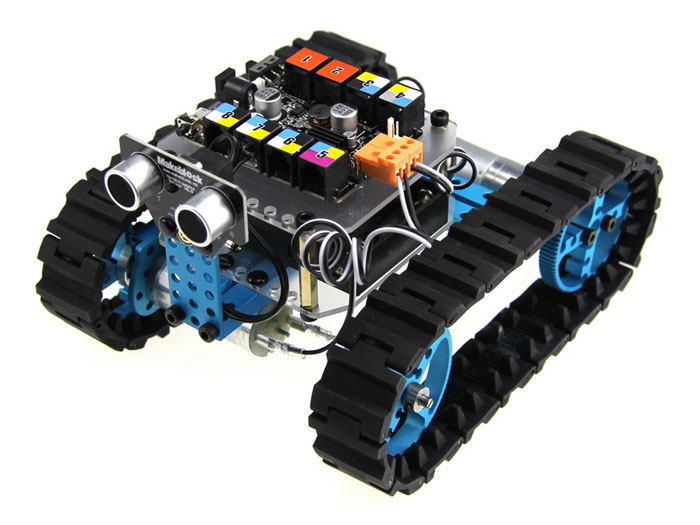
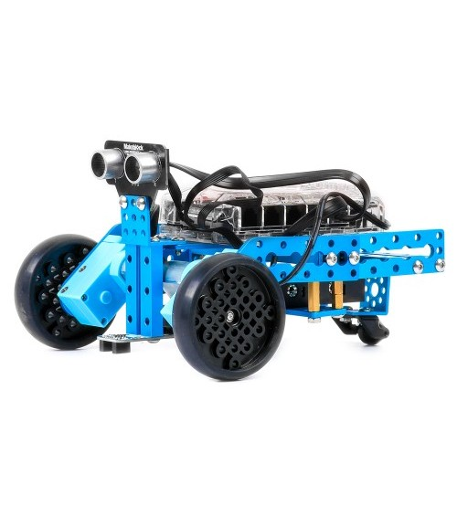
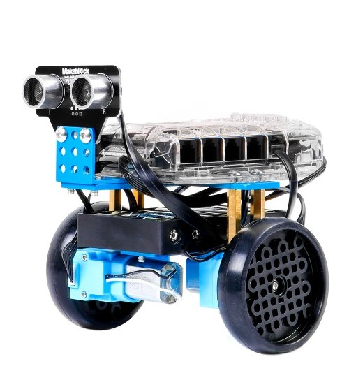

# Robótica con mBot

# Introducción

El objetivo de esta documentación es aprender a usar un entorno de programación por medio de bloques que se denomina Scratch y que permite desarrollar aplicaciones a la vez que se interacciona con los equipos de iniciación a la robótica de MakeBlock.

## Mbot

### [mBot Rosa](https://www.makeblock.es/productos/mbot_bluetooth_rosa/)

#### Sensores incluidos en la placa
* Sensor de luminosidad
* Emisor y receptor de infrarrojos (para usar el mando o comunicarte con otro mBot)
* Dos luces LED RGB para que las pongas del color que quieras
* Zumbador para emitir notas musicales
* Un pulsador programable

#### Módulos Externos incluidos
* Sensor de ultrasonidos
* Sensor sigue-líneas
* Módulo bluetooth de comunicación inalámbrica (para usarlo con el móvil o programarlo sin cables con Scratch)
* mBot 2.4G es el más recomendable si vas a utilizarlo en aulas, ya que se sincroniza automáticamente con el ordenador gracias a su mochila USB 2.4G (incluida)..." para que puedas programarlo remotamente con cada PC

[Comparativa robots mBot](http://www.makeblock.es/foro/topic/29/que-version-de-robot-educativo-mbot-compro)

Una buena alternativa es el proyecto [mClon](./mClon.md)

## Montajes

### Oruga

Usamos un montaje en oruga que proporciona buena tracción, aunque hace al robot más pesado

### 3 ruedas: 2 motrices y 1 una rueda loca

### 2 ruedas en equilibro (Avanzado y con versión nueva de Ranger)

Haremos un robot capaz de mantener el equilibro sobre 2 ruedas 

