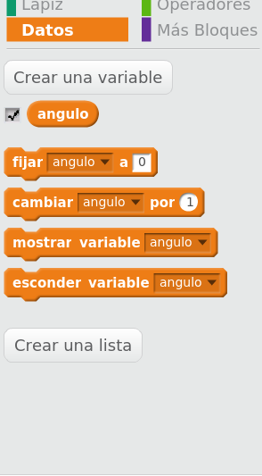
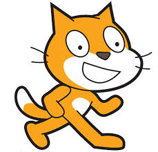

# Iniciación a Scratch

Usaremos una ampliación de Scratch (Ventajas del código abierto!!) llamada mBlock

## Descripción del interface

### Grupos de componentes

* Movimiento
* Apariencia
* Sonidos
* Lápiz
* Datos
* Eventos
* Control
* Sensores
* Operadores
* Robots
* Más bloques

## Formas de los bloques

### Abrir/Guardar/Compartir

¿Dónde encontrar ejemplos?

##  Dibujo con Scratch

Podemos mover nuestro personaje/objeto con el ratón
Podemos ejecutar movimientos o reposicionarlo sin más que hacer doble click en cualquier bloque

## ¡¡Vamos a dibujar!!

### Es un sistema pensado para ser muy adaptable

### Por eso tenemos que dar todos los pasos

### Tendremos que decir cuando usamos el lapiz y donde empezamos a dibujar

## Cuadrado

### Vamos a dibujar un cuadrado

### Tenemos claros los pasos:
	1. Línea
	2. Giro
	3. Línea
	4. Giro
	5. Línea
	6. Giro
	7. Línea
	8. Giro

## Antes de hacer otro ejemplo vamos a guardar este. Podemos hacerlo dándole nombre y también podemos descargarlo a nuestro PC

### ¡¡Pero podemos hacerlo más fácil
	Vamos a repetir 4 veces:
		1. Línea
		2. Giro

#### Usaremos el bucle

* * *

### ¿ Y si hacemos más de 4 giros?

### ¿Y si repetimos muchos cuadrados?

# Movimientos Relativos y absolutos

## Vamos a ver que podemos hacer casi siempre los cambios (movimientos, cambios de color,...) de dos formas:

* Fijando: damos un valor concreto
* Cambiando: damos el cambio que se va a hacer.

#### Conviene prestar especial atención a las coordenadas y a los movimientos

Ejemplos/EstrellaPoligonoPreguntado.sb2
Ejemplos/EstrellaPoligono.sb2

### Aspecto

#### Podemos cambiar el aspecto de los dibujos con diferentes opciones:

* Podemos cambiar el color del lápiz con las opciones de los bloques de lapiz
* Cambiar ancho

Los parámetros tienen un rango: el color entre 0 y 200 de manera cíclica

### Ejercicio: dibujar una linea con todos los colores disponibles (cambiar a cono de colores)

## Variables

### Nos permiten almacenar valores que pueden cambiar

# Tarea 0: rehacer el dibujo del polígono definiendo variables

### Podemos definir las variables para decidir el flujo de ejecución

# Tarea 1: Utilizando líneas haz un programa que permita dibujar un poligono según una variable con su número de lados

Ejemplos/Poligono.sb2
Ejemplos/Rango de colores.sb2
Ejemplos/Cuadrado de Colores.sb2
Ejemplos/Copo de nieve coloreado con bloque cuadrado.sb2
Ejemplos/Copo de nieve coloreado.sb2

## Coordenadas

## Borramos
## Colores
## Ocultamos al Panda

ScratchInteraccion.md

## Eventos
### Teclas
### Raton
### Otros

## Sentencias de Control

### Usanddo bucles repetitivos
### Ejercicio : estrella de 60 cuadrados de colores

#### Nos van a permitir establecer el orden de ejecución de los bloques:

* Podemos hacer bucles: contar y  mientras
* Condicionales: dependiendo de las operaciones lógicas

## Moviéndonos por la pantalla

## Personaje

### Cada personaje lleva su propio programa

## Las coordenadas son unas "variables especiales"

* Vamos a mover un personaje por la pantalla

* Usaremos las teclas (sensores y condicionales)

# Ejercicio: Vamos a mover un personaje con las teclas

### Un mismo personaje puede tener varios disfraces

### Ejercicio: crea una animación con varios disfraces

